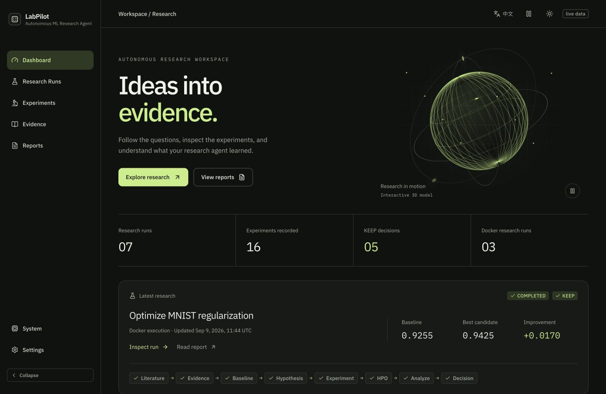
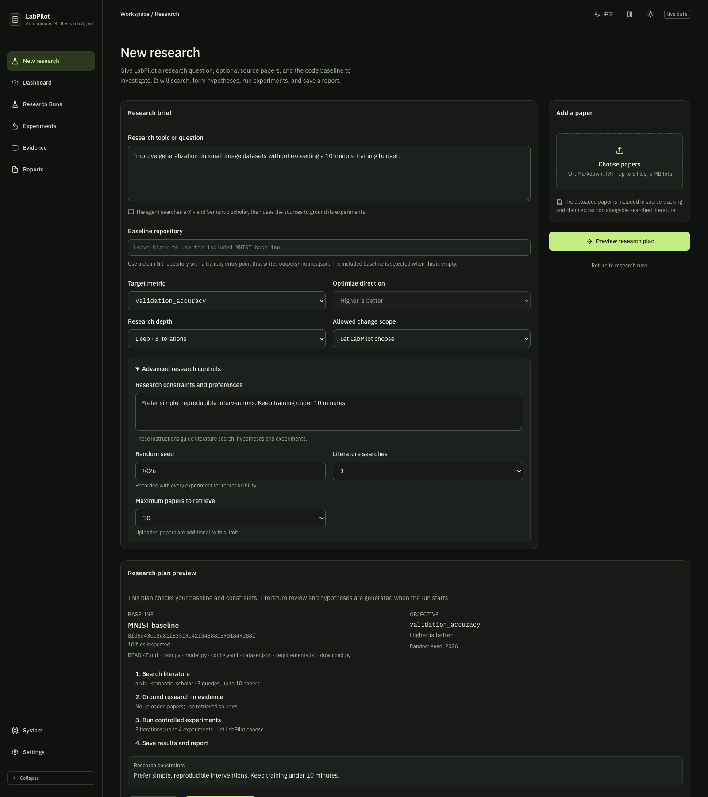
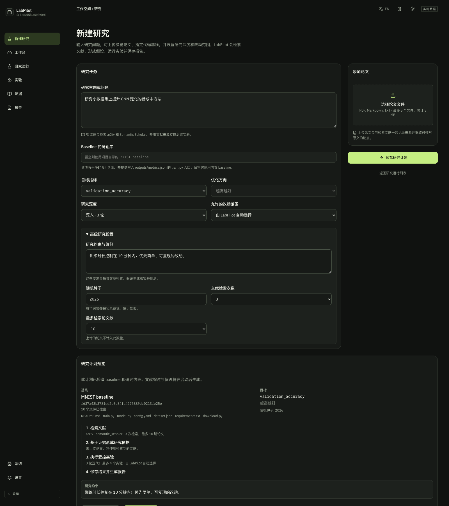
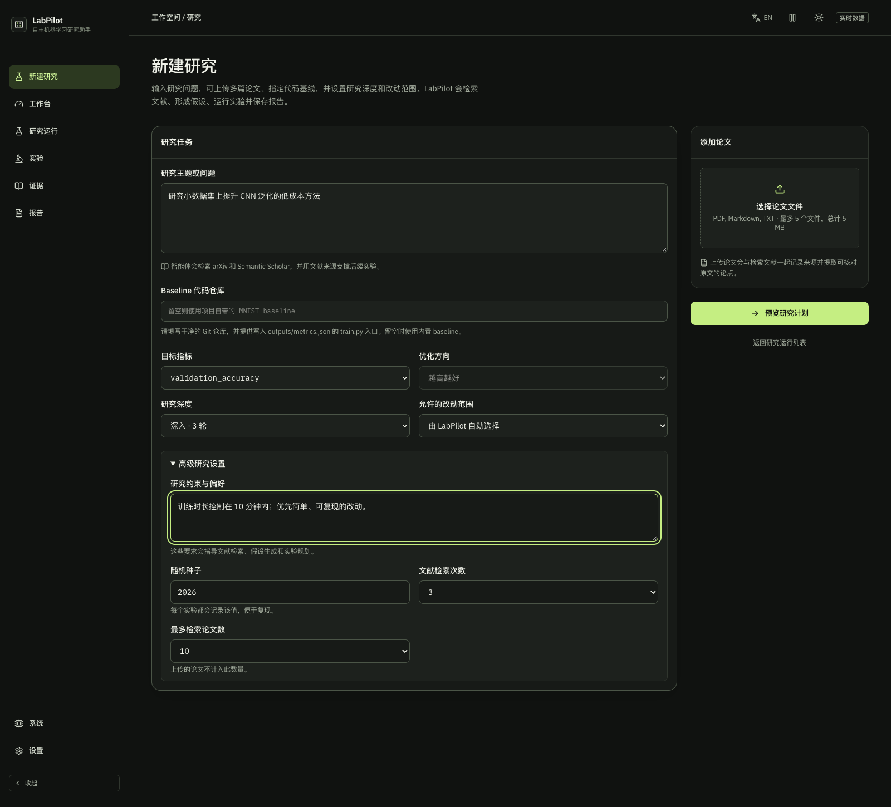
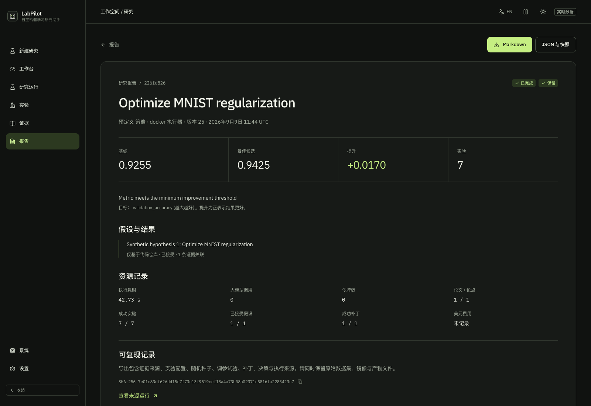

# LabPilot

<div align="center">

### From a research question to an experiment you can inspect, reproduce, and challenge.

LabPilot connects literature evidence, ML hypotheses, isolated experiments, and measured decisions in one recoverable workflow.

[English](README.md) · [简体中文](README.zh-CN.md) · [Get started](#get-started) · [See the results](docs/phase10-report.md)

[](https://github.com/JackZhu001/LabPilot/stargazers)




</div>

Research work is more than generating an idea. You need to know which source supports it, what changed in the code, how the experiment ran, and why the result was kept or rejected. LabPilot keeps that chain together—so a promising result is easier to verify and a failed result still teaches you something.

## A complete research loop, with you in control

| Shape the question | Ground it in sources | Test the change | Keep a useful record |
| --- | --- | --- | --- |
| Set the topic, baseline repository, target metric, seed, scope, and constraints. | Search arXiv and Semantic Scholar, or upload papers. Claims stay linked to source text. | Review the plan, then run bounded experiments in isolated Docker containers. | See measured metrics, diffs, provenance, and KEEP / REJECT / REPLAN decisions in a resumable report. |

LabPilot uses DeepSeek for research planning and optional code proposals. Jev can add structured evidence assessment through OpenRouter. Deterministic policies and measured experiment results remain the basis for experiment decisions.

## Explore the workbench

The interface is bilingual. Below are the English dashboard and paired plan previews; the two plan images use the same viewport so they line up evenly. The 3D dashboard scene is decorative; charts and decisions come from saved experiment records.

<table>
  <tr><th>English plan preview</th><th>中文计划预览</th></tr>
  <tr>
    <td></td>
    <td></td>
  </tr>
</table>

<details>
<summary>More screenshots: Chinese dashboard, custom research, and reports</summary>

**Chinese dashboard**


**Custom research settings**



**Saved report**



**English report preview**


</details>

Screenshots use local demonstration data. They illustrate the workbench, not a general claim about model performance.

## What makes LabPilot useful

- **Evidence you can follow:** paper → source-backed claim → evidence relation → hypothesis.
- **Experiments you can inspect:** isolated Docker runs preserve the baseline, code change, configuration, seed, artifacts, and metrics.
- **Decisions you can explain:** explicit thresholds produce KEEP, REJECT, or REPLAN; numerical results stay separate from model-generated prose.
- **Work you can resume:** SQLite checkpoints let a run continue after interruption, with a report generated from saved state.
- **Research you can customize:** start with a topic, uploaded papers, a local Git baseline, metric, constraints, and bounded search/experiment budgets.

## Get started

You can explore the workbench with simulated data and no model key. Python 3.11+ and Node.js are required; Docker is needed only for isolated real experiments.

```bash
uv sync --locked --extra dev
uv run labpilot run --goal "Does dropout improve validation accuracy?"
uv run labpilot serve-api --db .labpilot/labpilot.sqlite3
```

In another terminal:

```bash
cd frontend
npm ci
npm run dev
```

Open the local address printed by Vite. The first command creates a simulated run for the dashboard. See the [frontend guide](frontend/README.md) for more detail. Live research requires a DeepSeek key; Jev assessment requires an OpenRouter key. Keep both on the backend and out of browser code and Git.

## A real, bounded result

Phase 10 adds a CIFAR-10 RGB baseline and host-verified dataset preparation for network-isolated Docker runs. In the expanded eight-seed evaluation, dropout 0.3 had a mean paired validation-accuracy change of **−0.0123** (sample SD **0.0126**); it was rejected on all eight seeds. This is evidence about this short-training setup, not a universal conclusion about dropout. The [full report](docs/phase10-report.md) records the image, commit, seed range, metrics, and limitations.

## Built for traceability

```text
Research brief → sources → claims → hypotheses → reviewed plan
                                              ↓
                           isolated run → metric → decision → report
```

The workflow is backed by typed research state, explicit budgets, Git worktrees, Docker execution, SQLite checkpoints, Optuna HPO, and reproducible Markdown / JSON reports. See [architecture](#architecture), [CLI examples](#cli-examples), and [all phase reports](docs/).

<details>
<summary>Jev through OpenRouter</summary>

Set `OPENROUTER_API_KEY` in the backend environment and select **Jev** under Evidence assessment when creating a research run. LabPilot uses the pinned `typesafe/jev-1.13` model via OpenRouter Decisions API, and saves relation, relevance, strength, token usage, and cost with the evidence. See the [OpenRouter Jev guide](https://openrouter.ai/blog/tutorials/how-to-use-jev/).

The standalone `labpilot judge-evidence` CLI command uses TypeSafe's direct API and requires `TYPESAFE_API_KEY`.

</details>

<details>
<summary>Limitations and current scope</summary>

The built-in vision profiles are small, bounded benchmarks. The CIFAR-10 pilot is not a state-of-the-art comparison. Literature retrieval is limited to arXiv and Semantic Scholar metadata/abstracts unless you upload a paper. Jev assessments are advisory and do not replace source verification. See [limitations](#limitations) and the [Phase 10 report](docs/phase10-report.md).

</details>

## Architecture

```text
CLI → LangGraph adapter → research transitions → injected services
                  │               │
                  │               └── pure DecisionEngine + ResearchBudget
                  └── repository → SQLite (snapshot + indexed metadata)
```

The graph uses a small typed envelope around `ResearchState`; it does not use a
nested dictionary as its domain model. Nodes call a domain transition, save its
result, and return the updated state. This follows LangGraph's
[StateGraph and conditional routing API](https://docs.langchain.com/oss/python/langgraph/graph-api).
Business logic lives in `services/workflow.py`, numerical comparison in
`decisions/engine.py`, and storage in `persistence/repository.py`.

```text
Goal → inspect repository → query literature → papers → claims → evidence
                                                            ↓
                         measured baseline → grounded hypotheses → plan
                                                  │             │
                                                  │             ├→ config experiment
                                                  │             ├→ patch → Docker
                                                  │             └→ patch → Optuna → Docker trials
                                                  │                              ↓
                                                  └──── REPLAN ← critic ← metric analysis
                                                                               ↓
                                                                  KEEP / REJECT → END
```

Every entry is routed from the saved `next_step`. Before creating a hypothesis or
running an experiment, the domain workflow checks its relevant budget. Analysis
records a decision and rationale; the decision step applies it to the hypothesis
and selects termination or another iteration. All evidence and previous decisions
remain in the snapshot.

### Decision policy

The baseline specifies the objective name, direction, minimum improvement, and
significant regression threshold. Deltas are absolute metric units, not relative
percentages. For minimization, the comparison sign is reversed so a positive delta
always means improvement.

| Result | Decision |
| --- | --- |
| Improvement ≥ `min_delta` | KEEP |
| Regression ≥ `regression_delta` | REJECT |
| Inconclusive | REPLAN if another iteration is affordable; otherwise REJECT |
| Expected experiment failure | REPLAN if another iteration is affordable; otherwise REJECT |

Both thresholds must be positive and finite. Boundary comparisons use a `1e-12`
relative floating-point tolerance. An improvement can be kept on the last allowed
experiment. The baseline stays fixed for the run; KEEP terminates the run.

### Budget semantics

Counters record iterations started, experiments completed (success or failure),
failed experiments, and replans committed. The default limits are 3 iterations,
3 experiments, 2 failed experiments, and 2 replans.

- `can_continue()` checks whether a **new** iteration can start.
- `can_run_experiment()` checks experiment and failure capacity. The final already
  started iteration is allowed to finish even when the iteration cap is reached.
- `can_replan()` also requires a remaining replan slot and room for another iteration.
- A zero iteration, experiment, or failure limit prevents experiment work entirely.
  A zero replan limit permits the initial iteration but no retries.
- Budget termination before any experiment leaves the decision empty and records
  a termination reason. Exhaustion after an inconclusive/failed result yields REJECT.

### Checkpoint and resume contract

**SQLite is the single source of truth.** There is no second LangGraph checkpointer.
A committed row contains the complete validated snapshot, next-step cursor,
revision, and indexed metadata, all in one database transaction. `schema_version=1`
is explicit; unsupported versions are rejected rather than silently interpreted.

A successful node commits exactly one revision. `--stop-after N` pauses after N
steps in the current invocation. For example, `--stop-after 4` saves the completed
experiment with `next_step=analyze`. Resume loads it and runs analysis without
repeating the experiment. A completed run is an unchanged no-op on resume.

Unexpected service exceptions propagate and preserve the previous committed
cursor. Expected simulated experiment failures are recorded as FAILED and analyzed
normally. A crash **before a step commits** may replay that step. Stable UUIDs and
stateless fake providers make replay deterministic in Phase 1. This is checkpointed
step execution, not an exactly-once guarantee for future external side effects.

Optimistic revision checks reject stale writes. They do not acquire an execution
lease: two processes may execute the same uncommitted service before one write is
rejected. Use one executor per run. Phase 2 intentionally has no execution leases or
stale-worker coordination. Completed database checkpoints skip real execution on
resume. A crash during an active Docker step may leave a container, worktree, or
artifact directory that requires manual reconciliation. Existing execution
directories are refused rather than silently overwritten or restarted. Artifact
provenance is an audit output, not an independent resume checkpoint.

The fake outcome sequence and seed are persisted in the state. Restarting a CLI
process reconstructs the same fake services; it does not depend on a hidden random
number generator or in-memory call counter. IDs are stable within a research ID,
and control flow is deterministic. New research IDs and wall-clock timestamps vary.

HPO adds a linked Optuna SQLite database per study. Optuna owns trial suggestions
and its ask/tell states. The versioned LabPilot snapshot owns accepted executions,
results, counters, and the workflow cursor. Stable study/trial/experiment UUIDs and
Optuna trial numbers connect them. An interrupted ask is adopted on resume, and an
already synchronized result is accepted idempotently; conflicting records fail
closed. `study.json` is regenerated after checkpoints and is never a resume source.

## Project structure

```text
LabPilot/
├── pyproject.toml
├── uv.lock
├── README.md
├── .env.example
├── .gitignore
├── docs/phase2-report.md
├── docs/phase3-report.md
├── docs/phase4-report.md
├── docs/phase5-report.md
├── src/
│   └── labpilot/
│       ├── agent/
│       │   ├── patches.py
│       │   ├── repository.py
│       │   └── service.py
│       ├── cli/
│       │   ├── __init__.py
│       │   └── app.py
│       ├── decisions/
│       │   ├── __init__.py
│       │   └── engine.py
│       ├── execution/
│       │   ├── __init__.py
│       │   ├── artifacts.py
│       │   ├── docker.py
│       │   ├── git.py
│       │   ├── metrics.py
│       │   └── runner.py
│       ├── graph/
│       │   ├── __init__.py
│       │   └── workflow.py
│       ├── hpo/
│       │   ├── mapper.py
│       │   ├── models.py
│       │   ├── optuna.py
│       │   ├── reporting.py
│       │   ├── search_space.py
│       │   ├── selection.py
│       │   └── service.py
│       ├── llm/
│       │   ├── client.py
│       │   ├── deepseek.py
│       │   ├── errors.py
│       │   ├── fake.py
│       │   └── models.py
│       ├── models/
│       │   ├── __init__.py
│       │   ├── budget.py
│       │   ├── common.py
│       │   ├── execution.py
│       │   ├── experiments.py
│       │   ├── literature.py
│       │   ├── state.py
│       │   └── training.py
│       ├── persistence/
│       ├── literature/
│       │   ├── __init__.py
│       │   └── repository.py
│       ├── prompts/
│       │   ├── repository_inspection.md
│       │   ├── hypothesis_generation.md
│       │   ├── experiment_planning.md
│       │   ├── code_patch_generation.md
│       │   └── research_critic.md
│       ├── services/
│       │   ├── __init__.py
│       │   ├── fakes.py
│       │   ├── interfaces.py
│       │   ├── real.py
│       │   └── workflow.py
│       └── __init__.py
├── examples/
│   └── mnist_baseline/
│       ├── .dockerignore
│       ├── .gitignore
│       ├── Dockerfile
│       ├── README.md
│       ├── config.yaml
│       ├── download.py
│       ├── model.py
│       ├── requirements.txt
│       └── train.py
├── tests/
│   ├── docker/
│   │   └── test_integration.py
│   ├── live/
│   │   └── test_deepseek.py
│   ├── __init__.py
│   ├── conftest.py
│   ├── test_cli.py
│   ├── test_agent_models.py
│   ├── test_agent_safety.py
│   ├── test_agent_workflow.py
│   ├── test_decisions.py
│   ├── test_docker_adapter.py
│   ├── test_fakes.py
│   ├── test_git_execution.py
│   ├── test_hpo_models.py
│   ├── test_hpo_workflow.py
│   ├── test_llm.py
│   ├── test_metric_reports.py
│   ├── test_models.py
│   ├── test_persistence.py
│   ├── test_real_runner.py
│   ├── test_real_workflow.py
│   └── test_workflow.py
```

Phase 2 adds `execution/{git,docker,runner,metrics,artifacts}.py`,
`models/execution.py`, `services/real.py`, the MNIST example, and execution tests.
Phase 3 adds `hpo/`, typed training overrides, study/trial state, and HPO tests.
Phase 4 adds `agent/`, `llm/`, versioned prompts, typed outer-loop state, bounded
repository inspection and patch validation, plus offline and live DeepSeek tests.
Existing schema-version-1 snapshots remain readable because extensions have
compatible defaults. No database migration was needed. Optuna uses its own scoped
database for sampler state; it does not replace the LabPilot checkpoint repository.
Phase 5 literature search and retrieval are implemented; see
[`docs/phase5-report.md`](docs/phase5-report.md).

## Setup

Python **3.11+** is required. Dependency installation needs access to a package
index or a populated local cache.

```bash
python3 -m venv .venv
source .venv/bin/activate
pip install -e ".[dev]"
labpilot --help
labpilot init
```

For locked dependency resolution with uv:

```bash
uv sync --locked --extra dev
uv run labpilot --help
```

The default database is `.labpilot/labpilot.sqlite3`, relative to the current
working directory. Use the same `--db` path across commands when changing directories.
The CLI creates parent directories and initializes tables as needed; `init` is
optional and idempotent. `.env.example` documents the optional DeepSeek settings;
the app does not load `.env` files. Keep optional LangSmith tracing disabled for
offline execution if it was enabled in your shell by another application.

## CLI examples

```bash
labpilot run --goal "Does dropout improve validation accuracy?"
labpilot status <research-id>
labpilot status <research-id> --json
labpilot runs
```

The default fake outcome improves the baseline, resulting in KEEP at iteration 1.

Exercise REPLAN followed by KEEP, with a persisted interruption:

```bash
labpilot run --goal "Does dropout improve validation accuracy?" \
  --outcomes inconclusive,improve --stop-after 4 --db .labpilot/demo.sqlite3
labpilot status <research-id> --db .labpilot/demo.sqlite3
labpilot resume <research-id> --db .labpilot/demo.sqlite3
```

`--outcomes` accepts `improve`, `regress`, `inconclusive`, and `fail`. The last outcome
repeats if the sequence is shorter than the run. `--stop-after 6` pauses after the
first full iteration when REPLAN is selected; terminal decisions finish immediately.
The option is also available on `resume` and always counts steps in that invocation.

```bash
labpilot run --goal "Regression fixture" --outcomes regress
labpilot run --goal "Failure fixture" --outcomes fail,improve
labpilot run --goal "Bounded inconclusive fixture" --outcomes inconclusive \
  --max-iterations 2 --max-experiments 2 --max-failed-experiments 1 --max-replans 1
labpilot --verbose run --goal "Logged fixture"
```

Library callers can construct `ResearchState` with a custom `Baseline` and inject
`ResearchServices` into `graph.workflow.execute`. The CLI deliberately exposes only
a small set of fake and Docker execution options.

Run the predefined Phase 3 MNIST inner-loop search:

```bash
labpilot prepare-example .labpilot/baselines/mnist-hpo
labpilot run --goal "Optimize MNIST regularization" \
  --executor docker --repo .labpilot/baselines/mnist-hpo \
  --hpo --trials 6 --sampler-seed 42 \
  --max-replans 0 --min-delta 0.001
labpilot status <research-id>
```

`--hpo` requires Docker execution. `--trials` sets both the study plan and HPO trial limit. The default Docker HPO
experiment budget includes one measured baseline plus every requested trial.
`--sampler-seed` controls the reproducible Phase 3 TPE policy. `status` and the
final run output show every trial, its parameters, metric, runtime, best trial,
baseline, and raw delta. Use `--stop-after N` and then `resume` to exercise a fresh
process restart; committed trials are not executed again.

Run the bounded Phase 4 DeepSeek outer loop:

```bash
export DEEPSEEK_API_KEY="..."
export DEEPSEEK_BASE_URL="https://api.deepseek.com"
export DEEPSEEK_MODEL="deepseek-flash"
labpilot prepare-example .labpilot/baselines/mnist-phase4
labpilot run --goal "Improve validation accuracy while keeping the model lightweight" \
  --agent --executor docker --repo .labpilot/baselines/mnist-phase4 \
  --max-iterations 2 --max-llm-calls 10 --trials 4 \
  --max-patch-repairs 1 --max-replans 1 --min-delta 0.001
```

Credentials are read only from the process environment. They are never accepted as
CLI arguments or stored in state, SQLite, prompts, artifacts, reports, or logs.
`DEEPSEEK_BASE_URL` defaults to the value above; the default model is `deepseek-flash`.
For a local `.env`, load it with `set -a; source .env; set +a` before running the CLI.
Agent mode
requires Docker. Use `status` to inspect persisted structured outputs and usage;
ordinary `resume` starts at the next uncommitted logical role.

Start the API and frontend in separate terminals to inspect or create research runs:

```bash
uv run labpilot serve-api --db .labpilot/labpilot.sqlite3
cd frontend && npm install && npm run dev
```

Open `http://localhost:5173`. The frontend proxies `/api` to the local API;
set `VITE_LABPILOT_USE_MOCKS=true` for optional UI fixtures. See
[`frontend/README.md`](frontend/README.md) for routes and data contracts.

Choose **New research** in the dashboard to submit a topic, optionally upload up to
five PDF/Markdown/text papers (5 MB total), and select a clean local Git baseline.
Choose one to three research iterations and constrain proposed experiments to
configuration-only or source-code changes. Leaving the baseline path blank uses the
included MNIST example. Runs use DeepSeek and Docker, and execute in the background.
Load `DEEPSEEK_API_KEY` into the API process environment.

## Development

```bash
pytest
ruff check .
ruff format --check .
mypy src
```

Tests block socket connections and DNS resolution and remove API keys. Coverage
includes domain validation and provenance, decision thresholds in both directions,
all routing outcomes, each budget limit, fake determinism, stale database writes,
restart at every nonterminal step of a two-iteration run, exceptions before commit,
committed experiments not rerunning, and CLI behavior. Tests use temporary databases.

The [measured Phase 2 report](docs/phase2-report.md) and
[measured Phase 3 report](docs/phase3-report.md) record earlier demos. The
[measured Phase 4 report](docs/phase4-report.md) records the real DeepSeek agent
loop, token usage, Docker result, and baseline integrity. The
[Phase 4.1 code-plus-HPO validation](docs/phase4-code-hpo-validation.md) records a
real DeepSeek-generated model patch executed across four Optuna/Docker trials,
including exact diff provenance and zero-work completed resume.

## Phase 2: isolated real execution

```text
Clean baseline repository at a recorded commit
    ↓
Detached, UUID-named Git worktree
    ↓
Validate and apply supplied unified diff (candidate only)
    ↓
Capture actual diff and a copy of regular tracked source files
    ↓
Docker: read-only source, writable outputs, network disabled
    ↓
outputs/metrics.json → typed MetricReport → persisted ExperimentResult
    ↓
Measured baseline comparison → KEEP / REJECT / REPLAN
```

The baseline and candidate use the same `DockerExperimentRunner`. A new `baseline`
workflow step records the unmodified experiment and replaces the numerical
baseline with its measured primary metric. A candidate then uses the predefined
0.0 → 0.3 dropout patch. The baseline counts toward `max_experiments`; both baseline
and candidate failures count toward the failure cap. Baseline retries consume
replan slots without inventing a hypothesis iteration. Two experiments and zero
replans produce a single baseline/candidate comparison.

The baseline checkout must be a clean **dedicated repository root**. Worktree
registration necessarily updates Git's administrative metadata, but neither its
HEAD nor its tracked/untracked working-tree contents are changed by experiments.
Each real result records a post-execution HEAD and cleanliness check. Runtime
storage must be outside the baseline repository. Cleanup verifies that a target
is a UUID-named direct child of the managed root and is registered to that baseline.
It refuses unrelated paths and symlinks.

### Run the MNIST example

Prerequisites: Python 3.11+, Git, and a running Docker daemon. No GPU is needed.
Initial image preparation downloads dependencies and MNIST; training runs with
networking disabled. See [the example README](examples/mnist_baseline/README.md)
for its data split, model configuration, and reproducibility limits.

```bash
labpilot prepare-example .labpilot/baselines/mnist
labpilot run --goal "Does dropout improve validation accuracy?" \
  --executor docker --repo .labpilot/baselines/mnist \
  --max-experiments 2 --max-replans 0 --min-delta 0.001 --stop-after 5
labpilot status <research-id>
labpilot resume <research-id>
```

The preparation command copies and commits the template into a new repository;
it refuses existing destinations. In Docker mode, step 3 completes the baseline
and step 5 completes the first candidate. Pausing there leaves `next_step=analyze`.
A fresh `resume` process compares the already persisted metrics without repeating
training. `status --json` exposes both experiment results, their provenance, and
the final decision rationale.

Options include `--patch FILE`, `--image IMAGE`, `--reuse-image`, `--timeout SECONDS`,
`--runtime-root PATH`, `--min-delta`, and the existing budget flags. With image reuse,
the caller is responsible for providing an image with suitable dependencies/data.
`ExperimentConfig.metric_name` is the primary metric name; its `primary_metric`
property exposes the same value. Direction is explicit in `ExperimentConfig` and
`Baseline`. Library callers can select another objective/direction and training
command without placing execution logic in graph nodes.

### Docker and artifacts

`DockerClient` handles image preparation, container creation, attachment, exit-code
inspection, timeout killing, and removal. The runner coordinates it with separate
worktree and metric services. Docker commands use argument lists, never a host
shell. The resolved immutable image ID, command, resource limits, and container ID
are retained. The container has a read-only root filesystem and source mount,
network `none`, dropped capabilities, no-new-privileges, two CPUs, 2 GiB memory,
a PID limit, a temporary filesystem, and one writable output mount. Neither the
Docker socket nor the baseline checkout is mounted. These controls use Docker's
[documented container options](https://docs.docker.com/reference/cli/docker/container/run/).

Dataset archives are downloaded and checksum-verified on the host, then staged into
the image before training. Training containers keep `network=none`; only image setup
and dependency installation may use the network. Direct Python dependencies are
pinned; transitive dependencies and the base image tag are not fully locked.
Actual image IDs and complete source snapshots identify the environment/code used
for a measured result. This is not a promise of bit-level reproducibility across
architectures or future image rebuilds.

```text
.labpilot/
├── baselines/mnist/                 # Dedicated clean Git repository
├── worktrees/<experiment-id>/       # Temporary; removed after execution
└── runs/<research-id>/<experiment-id>/
    ├── stdout.log                  # Build/training stdout
    ├── stderr.log                  # Build/training stderr
    ├── patch.diff
    ├── actual.diff
    ├── provenance.json
    ├── source/                     # Retained tracked-source snapshot; no .git
    └── outputs/metrics.json
```

`ResearchState.experiments[*].result.execution` stores typed provenance, including
identity, baseline commit, worktree identity, actual diff, source hash,
configuration text, seed, image/container identity, command, timestamps, total
runtime, exit code, metric report, failure reason, and cleanup warnings. Logs stay
on disk. The total runtime includes preparation, execution, validation, and cleanup.
The database remains authoritative for ordinary resume; artifact retention is
manual in this phase.

### Metrics and failures

The training command must write a regular, non-symlink file at
`outputs/metrics.json`, no larger than 1 MiB:

```json
{
  "schema_version": 1,
  "metrics": {
    "validation_accuracy": 0.91,
    "validation_loss": 0.25
  },
  "metadata": {"seed": 42, "epochs": 2}
}
```

These numbers illustrate the schema, not a reported experiment. `metrics` is an
explicit mapping of metric names to finite JSON numbers. Metadata is optional;
when present, its seed must match the experiment. Duplicate keys, nonfinite values,
unknown fields, invalid versions, malformed JSON, missing files, and a missing
primary metric are failures. Natural-language logs are never used for comparison.

Invalid/conflicting patches, Docker build failures, nonzero exits, timeouts, and
metric errors return FAILED results for the existing decision policy. Timeout is
also distinguished in execution provenance. Worktree/container cleanup warnings
are logged and retained separately, preserving a valid metric or the original
failure. Unexpected storage/programming errors still propagate rather than being
misrepresented as a scientific result.

### Docker tests

```bash
pytest                 # Fast offline suite; Docker tests deselected
pytest -m docker       # Real MNIST, persisted resume, timeout, exit and missing metrics
ruff check .
ruff format --check .
mypy src
```

Docker tests skip only when Docker is unavailable. Once a daemon is reachable,
build and execution failures fail tests. Initial integration-test image preparation
may need network access; subsequent training is offline. Unit tests use temporary
Git repositories and mocked Docker boundaries, with socket access blocked.

## Phase 3: hierarchical HPO

```text
Hypothesis + fixed candidate patch
    ↓
ExperimentPlan → typed SearchSpace
    ↓
Persistent Optuna study (seeded TPE)
    ↓
Sampled parameters → validated TrainingOverrides
    ↓
DockerExperimentRunner → outputs/metrics.json
    ↓
LabPilot Trial + Optuna tell
    ↓ repeat within budget
Best successful trial → measured baseline → DecisionEngine
```

The outer loop chooses what code or architecture to try: a hypothesis may carry one
fixed patch and a search space. The inner loop chooses numeric and categorical
values for that fixed candidate. Phase 3 implements only the inner loop. Optuna,
rather than a language model, samples `learning_rate`, `dropout`, `hidden_dim`, and
`batch_size` for the MNIST fixture.

`SearchSpace` is a discriminated union of `FloatParameter`, `IntParameter`, and
`CategoricalParameter`. It rejects reversed bounds, incompatible log/step options,
steps that do not divide the range, empty or duplicate choices, and duplicate names.
Sampled values cross into execution only through the validated `TrainingOverrides`
model. The runner writes `labpilot-parameters.json` into the captured trial source;
the training script reads only those four supported fields. Each trial retains the
same candidate patch but gets a separate worktree, artifact directory, container,
experiment ID, and provenance record.

Each study has a stable UUID/name and stores Optuna data at:

```text
.labpilot/runs/<research-id>/studies/<study-id>/
├── optuna.sqlite3     # Optuna-owned suggestions and ask/tell states
└── study.json         # Regenerable human/machine-readable LabPilot view
```

The LabPilot snapshot contains typed `ExperimentPlan`, `OptimizationStudy`, and
`Trial` records. Reserving a trial charges `experiments` and `hpo_trials` together,
exactly once. Execution failure also charges the existing failed-experiment counter,
is reported to Optuna as failed, and does not stop later trials while budget remains.
The study ends FAILED when it has no successful trial. Advanced pruning is omitted
because the current trainer emits only final metrics; a `NopPruner` avoids inventing
intermediate observations.

Best-trial selection considers successful trials only, respects maximize/minimize,
and breaks equal metrics by Optuna trial number then UUID. The selected metric is
passed to the existing `DecisionEngine`; the baseline is measured once and is never
an Optuna trial. The per-trial seed policy is recorded as
`seed_plus_trial_number_v1`, so a restarted process reproduces the same remaining
suggestion sequence without relying on an in-memory sampler RNG.

## Phase 4: structured agent harness

Phase 4 adds five bounded logical roles: repository inspection, hypothesis
generation, experiment planning, code generation, and research critique. They are
not independent chat loops. LangGraph invokes one typed service per durable cursor,
and every accepted result enters the shared `ResearchState` before the next role.
Deterministic capabilities remain ordinary tools behind the harness.

`LLMClient.generate_structured()` is provider-independent. `DeepSeekLLMClient`
implements it through the OpenAI-compatible Chat Completions API with JSON mode,
Pydantic JSON Schema instructions, validation feedback, and bounded retries. The
default model is `deepseek-flash`; the base URL, model, and API key come from
environment variables. Only model/base URL settings are persisted. Request IDs,
operation/template identity, input/output/cached/reasoning token counts, model, and
latency are stored in `LLMUsage` records.

The deterministic inspector starts from tracked Git files, caps tree, file, and
total context sizes, and selects relevant text sources. It excludes `.git`, virtual
environments, dependencies, datasets, outputs, logs, binary files, `.env*`, and
credential/secret names. Large source text is not stored in `ResearchState`; the
typed summary and bounded file metadata are stored.

Hypotheses explicitly use `REPOSITORY_AND_EXPERIMENT_HISTORY` as their evidence
source. A maximum batch of three is ranked deterministically by confidence,
expected impact, estimated cost, duplicate history, and lexical tie-breaking. The
planner returns one typed `CONFIG_ONLY`, `CODE_CHANGE`, or `CODE_CHANGE_WITH_HPO`
plan. HPO spaces pass the Phase 3 validators plus parameter/count/project limits,
and requested trials are clamped to remaining budgets.

Code proposals contain an exact base SHA, declared target files, and unified diff.
Before a Docker run, LabPilot checks size, headers, approved paths, traversal,
secret/runtime targets, and disallowed command execution. It applies the diff in a
disposable managed worktree and compiles changed Python sources. One configurable
repair attempt is allowed. A final preflight failure becomes a structured failed
experiment and enters the normal analysis policy without starting HPO or Docker.

The critic receives the already-computed decision and may only explain it. Its
schema and post-validation reject a changed decision or hypothesis identity. On
REPLAN, the next hypothesis prompt contains structured prior hypotheses, decisions,
metrics/failures, and remaining budget. Completed role checkpoints are not repeated
by ordinary resume. Provider/authentication/token-budget failures are persisted as
BLOCKED at the retry cursor; invalid final structured output becomes FAILED.

## Limitations

- Experiment execution, metrics, inner-loop HPO, opt-in DeepSeek outer-loop
  proposals, and bounded arXiv/Semantic Scholar literature retrieval are real.
- One local executor per run; no leases, distributed scheduling, or automatic
  reconciliation after a process crash during active Docker execution.
- Worktrees and containers are cleaned up normally, but cleanup failures can leave
  resources for manual inspection. Source snapshots, logs, images, and datasets are retained.
- Only text patches and regular tracked source files are supported; symlinks,
  submodules, Git metadata, and pre-existing output paths are rejected.
- Dockerfiles, images, repositories, and patches are trusted local inputs. Docker
  isolation here is not a complete defense against intentionally hostile code.
- Schema extensions are backward-compatible; migration tooling remains deferred.
- No MLflow, distributed execution, paper
  writing, or vector database.
- The current HPO implementation is sequential and supports final metrics only.
  It has no pruning, executor leases, parallel workers, or active-container recovery.

## Roadmap

| Phase | Scope |
| --- | --- |
| 1 | Typed state, deterministic orchestration, SQLite checkpoint/resume |
| 2 | Git worktrees, supplied patches, Docker execution, real MNIST metrics |
| 3 | Typed, persisted, budgeted Optuna HPO through Docker trials |
| 4 | Structured DeepSeek outer loop and validated patch planning |
| 5 | arXiv and Semantic Scholar evidence grounding — complete |
| **6** | Snapshot reports, observational benchmarks, and frontend integration — complete |
| **7** | Resumable multi-seed evaluation runs and paired metric summaries — complete |
| **8** | DeepSeek proposal handoff and multi-seed validation — complete |
| **9** | FashionMNIST profile and source-linked multi-seed evaluation — complete |
| **10** | CIFAR-10 RGB profile, CNN baseline and 11-seed Docker evaluation — complete |

### Remaining work

- [x] Generate reproducible reports from persisted results and provenance (Phase 6).
- [x] Add observational benchmark workflow (Phase 6).
- [x] Add resumable multi-seed evaluation command (Phase 7, first increment).
- [x] Validate the resumable Docker evaluator across 8 seeds and two dropout settings (Phase 7).
- [x] Run a bounded live DeepSeek experiment and hand its CONFIG_ONLY proposal into resumable multi-seed evaluation with source lineage (Phase 8).
- [x] Add MNIST and FashionMNIST profiles with explicit versions, splits, and metrics (Phase 9).
- [x] Reject unsupported dataset profiles and mismatched reported metadata.
- [x] Run DeepSeek-source-linked FashionMNIST evaluation across 8 seeds; record uncertainty without promoting the intervention.
- [x] Add a 32×32 RGB CIFAR-10 profile with a model-specific CNN baseline and verified dataset cache (Phase 10).
- [x] Complete a source-linked CIFAR-10 Docker evaluation across 11 fixed seeds and record uncertainty (Phase 10 validation).


## Reports and evaluation (Phase 6)

`labpilot report RUN_ID --db PATH --format markdown` exports a deterministic research
report to stdout. Use `--format json` for its complete versioned state and SHA-256
snapshot fingerprint. Redirect stdout to retain an export. Reports include hypotheses,
evidence, configurations, seeds, patches, trials, decisions and execution provenance;
retain referenced artifact files, datasets and Docker images separately.

`labpilot benchmark --db PATH --db OTHER_PATH --format markdown` compares saved runs
across databases. Repeat `--run-id UUID` to select runs; JSON is the default format.
Exact duplicate snapshots are counted once; conflicting revisions are rejected.
The comparison groups recorded execution conditions and budgets, separates simulations,
and excludes incomplete/unmeasured runs from improvement statistics. Positive improvement
means better for both maximize and minimize objectives. This is observational evaluation,
not a controlled ablation or a causal estimate of literature grounding. Dollar cost is
unknown; recorded tokens and execution time are shown instead.

Start `labpilot serve-api --db PATH`, then the frontend. `/reports` provides run selection,
cohort comparison and exports; `/reports/RUN_ID` previews a saved report. The dashboard
includes a CSS 3D research model with pause control, reduced-motion support and persistent
light/dark themes. No additional frontend dependencies are required.
See [Phase 6 validation](docs/phase6-report.md).


## Phase 7: repeated evaluation

Run the same research configuration sequentially with independent seeds:

```bash
labpilot evaluate --goal "Does dropout improve validation accuracy?" \
  --seeds 42,43,44 --executor docker --repo .labpilot/baselines/mnist-phase4 \
  --evaluation-id 9cf9a8c8-35c1-4cb4-8773-596271b6ccbb
```

Omit `--executor docker --repo ...` for an offline control-flow simulation; simulated
outcomes ignore seeds and are not measurements. Keep the generated evaluation ID to
resume after interruption. Seed runs are stored in SQLite, and a JSON manifest freezes
the goal, seed list and execution settings. The same ID with changed settings is rejected.
The summary computes each candidate’s improvement against its own measured baseline,
then aggregates across seeds under matching execution conditions and candidate
interventions. Real Docker batches are sequential and consume training resources.
See [Phase 7 results](docs/phase7-report.md) and the
[DeepSeek-guided Phase 8 evaluation](docs/phase8-report.md).

## Phase 8: DeepSeek-guided evaluation

The first increment uses the bounded DeepSeek agent to select configuration-only
interventions, then checks proposed dropout settings over matching seeds. The API key
is read from `DEEPSEEK_API_KEY`; `.env` is ignored by Git and must be loaded into the
shell explicitly. Results, token use, failed attempts, and remaining work are recorded
in [the Phase 8 report](docs/phase8-report.md).

To evaluate a completed CONFIG_ONLY agent proposal without manually rebuilding its
override, use its Research ID as `--from-run`. The source, baseline commit, image, and
training command must match; pass the same Docker image identifier used by the source
run so resumed evaluations stay reproducible.

```bash
labpilot evaluate --seeds 42,43,44 \
  --executor docker --repo .labpilot/baselines/mnist-phase4 \
  --image sha256:... --reuse-image --db .labpilot/phase8-deepseek/labpilot.sqlite3 \
  --runtime-root .labpilot/phase9-evaluation --min-delta 0.001 \
  --from-run RUN_ID
```

Phase 9 added FashionMNIST with dataset-aware validation and a source-linked 8-seed
evaluation. Phase 10 adds CIFAR-10's 32×32 RGB input through a dedicated CNN profile;
its verified archive is prepared on the host so training containers remain network
isolated. Across the expanded eight-seed batch, dropout 0.3 shows a mean paired
change of −0.0123 with a sample standard deviation of 0.0126, which does not
support a stable improvement claim;
see [the Phase 10 report](docs/phase10-report.md).
