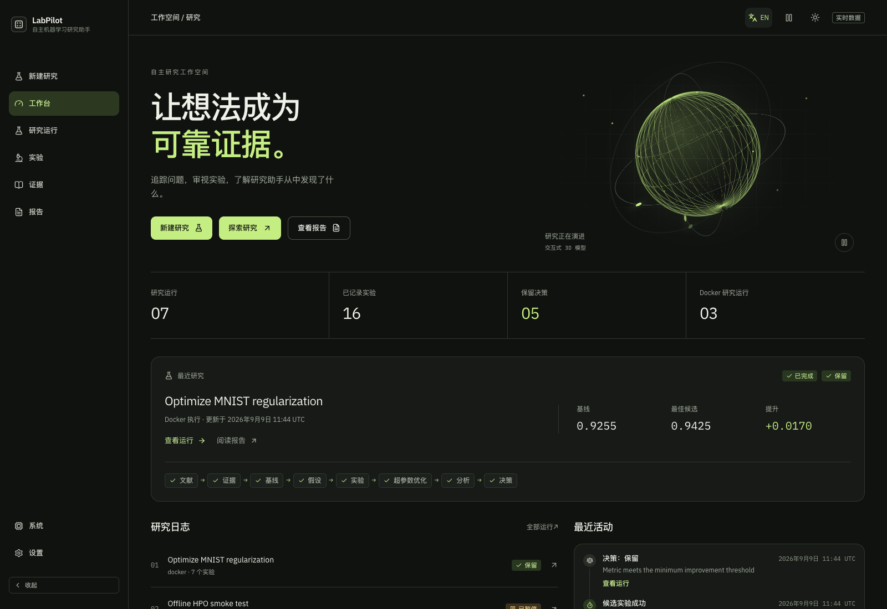
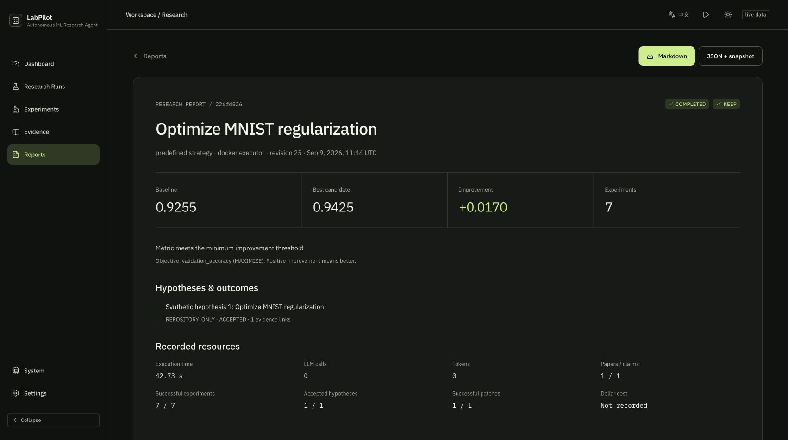

# LabPilot

**自主机器学习研究与实验助手** · [English](README.md)

从文献证据到可测量的实验结果：LabPilot 将假设、代码变更、隔离执行、指标与决策连接到同一份可恢复的研究状态。



## 可以做什么

- **文献与证据**：检索 arXiv / Semantic Scholar，提取可核对的摘要论点，保留论文、证据与假设之间的关联。
- **研究与实验**：DeepSeek 生成结构化研究计划、假设和补丁；通过 Git 工作树和 Docker 执行实验。
- **超参数优化**：Optuna 搜索空间、试验状态和预算持久化，支持失败后继续后续试验。
- **确定性决策**：依据真实指标与阈值选择保留、拒绝或重新规划，支持最大化与最小化目标。
- **报告与对比**：导出带版本和 SHA-256 指纹的 Markdown / JSON 报告，按记录的实验条件对比历史运行。
- **双语工作台**：中英文切换、深浅主题、交互式 3D 模型、页面与卡片动效、全局动画暂停以及系统减少动态效果支持。

研究目标、论文原文、代码、原始状态与导出快照保留原始语言。动画模型是视觉展示，不代表实时科研进度。

## 本地启动

需要 Python 3.11+，以及符合当前 Vite 版本要求的 Node.js。Docker 仅在运行真实隔离实验时需要。

```bash
python3 -m venv .venv
source .venv/bin/activate
pip install -e ".[dev]"
labpilot run --goal "Does dropout improve validation accuracy?"
labpilot serve-api
```

上面的研究命令使用默认离线模拟模式，不会产生真实训练结果。另开一个终端启动前端：

```bash
cd frontend
npm ci
npm run dev
```

打开终端显示的本地地址。顶栏可切换语言、动画与主题，偏好保存在本设备上。真实实验与 DeepSeek 配置请查看 [完整使用说明](README.md#setup)，密钥通过环境变量提供，不要提交到仓库。根目录 `.env` 不会自动加载，使用前运行 `set -a; source .env; set +a`。

## 多种子评估（Phase 7）

使用相同目标和实验设置，对多个随机种子逐个运行并汇总配对提升值：

```bash
labpilot evaluate --goal "Does dropout improve validation accuracy?" \
  --seeds 42,43,44 --executor docker --repo .labpilot/baselines/mnist-phase4 \
  --evaluation-id 9cf9a8c8-35c1-4cb4-8773-596271b6ccbb
```

中断后使用相同的评估 ID 和参数重新运行即可从 SQLite 检查点续跑。离线模拟模式可省略 Docker 参数，但模拟结果不会随种子变化，不能作为真实训练测量。

真实 Docker 评估已扩展到 8 个种子（42–49）：平均配对提升为 -0.000562，样本标准差为 0.001898，2/8 达到 KEEP 门槛。结果不支持认为 dropout 改动稳定有效。完整配置、运行 ID 和限制见 [Phase 7 实测记录](docs/phase7-report.md)；后续仍需更多种子与预先定义的干预。

## 报告



```bash
labpilot report RUN_ID --db .labpilot/labpilot.sqlite3 --format markdown > report.md
labpilot benchmark --db .labpilot/labpilot.sqlite3 --format json > benchmark.json
```

报告从已保存状态生成，不会调用大模型或重新训练。重现实验时还需保留原始数据集、镜像和产物文件。

## 当前进度与边界

Phase 1–8 的有限 MNIST 流程已实现；Phase 9 将扩展到其他数据集。Phase 8 已支持将 DeepSeek 的 CONFIG_ONLY 方案直接交给可续跑的多种子评估，并完成 8 个种子的端到端验证。dropout 0.2 和 0.3 在各 8 个种子上的平均提升均为负值，目前没有稳定收益证据。详见 [Phase 7 实测记录](docs/phase7-report.md) 和 [Phase 8 结果及 Phase 9 TODO](docs/phase8-report.md)。截图为本地演示运行，MNIST 结果不能代表通用能力。

评估已完成的 DeepSeek 配置方案时，可通过 `labpilot evaluate --from-run RUN_ID` 直接复用，不必手动重建参数。来源运行、仓库提交、镜像标识和训练命令必须匹配；运行清单和报告会保留来源 ID 与候选配置。

Phase 9 TODO：增加第二个数据集并明确记录数据划分和指标；按数据集能力校验方案参数；在该数据集上复跑来源可追溯的多种子对照，再讨论 MNIST 之外的结论。

历史运行对比属于观察性统计，不证明文献策略的因果收益。项目是有边界的研究自动化系统，目前不应宣称已经实现递归自我改进（RSI）。

## 验证

```bash
pytest -q
ruff check src tests
mypy src
cd frontend
npm run build
npm run lint
npm run smoke
```

前端烟雾检查覆盖路由渲染与语言翻译。默认后端测试排除需要 Docker 或真实外部服务的测试。
